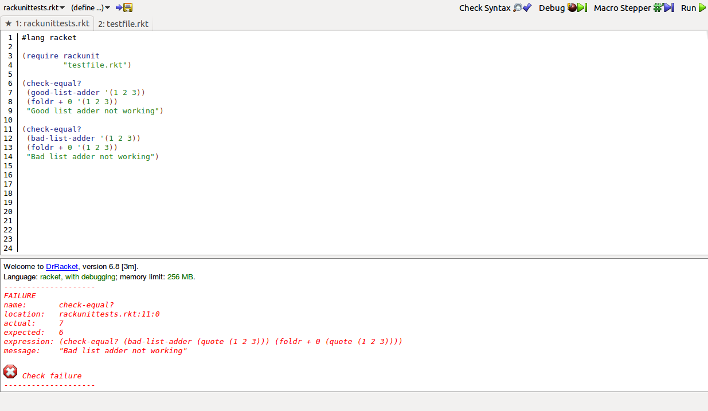

## My Library: RackUnit
My name: Jooseppi Luna

For my library exploration I chose to explore the RackUnit library, a library that allows you to write unit tests in Racket.  It seemed like a fun library, (I enjoy unit testing), and it also looks like something that could be really useful for a larger project where a lot of code is being written and edited.  For the first few tests, I wrote a correct and incorrect version of a basic accumulation:

``` racket
(define (good-list-adder l)
  (foldr + 0 l))

(define (bad-list-adder l)
  (foldr + 1 l))
```
To test these functions using RackUnit, you must first include the following statement at the end of your code:
``` racket
(provide good-list-adder
         bad-list-adder)
```
This gives the unit test file access to these procedures.

Then, in your test file, you must first include the library and tell it what file the code it is testing is located in:
```racket
(require rackunit
         "testfile.rkt")
```
Then, you get to write some tests.  The basic format for a test is as follows:
```racket
(check-equal? <procedure being tested> <expected result> <optional string message>)
```
Here are two tests written for the accumulates above:
```racket
(check-equal?
 (good-list-adder '(1 2 3))
 (foldr + 0 '(1 2 3))
 "Good list adder not working")

(check-equal?
 (bad-list-adder '(1 2 3))
 (foldr + 0 '(1 2 3))
 "Bad list adder not working")
 ```
 The first test succeeds and reports nothing; the second test fails and produces the following output (shown both in a screenshot and a code block):


 
```
--------------------
FAILURE
name:       check-equal?
location:   rackunittests.rkt:10:0
actual:     7
expected:   6
expression: (check-equal? (bad-list-adder (quote (1 2 3))) (foldr + 0 (quote (1 2 3))))
message:    "Bad list adder not working"

. Check failure
--------------------
```
The failue message gives you a lot of useful information: among other things, it gives you the expected and actual values produced, what line in your test file failed, and, if one was included, the message from the test.

A more advanced method is to group a bunch of tests together in a test-case form.  It allows us to end testing as soon as one condition fails; this is useful in a situation where subsequent tests will not pass if the previous ones have failed.  The following example tests our make-sum function from exercise 2-58: (make-sum shown first, then the test)
```racket
(define (make-sum a1 a2)
  (cond ((=number? a1 0) a2)
  ((=number? a2 0) a1)
  ((and (number? a1) (number? a2)) (+ a1 a2))
  (else (list a1' + a2))))
```
```racket
(test-case
 "Testing make-sum"
 ;; check to make sure that make-sum returns a list three long
 (check-equal?
  (length (make-sum 'a 'b))
  3 "Incorrect length for make-sum-good")
 (check-equal?
  (car (make-sum 'a 'b))
  'a "Incorrect car for make-sum-good")
 (check-equal?
  (cadr (make-sum 'a 'b))
  '+ "Incorrect cadr for make-sum-good")
 (check-equal?
  (caddr (make-sum 'a 'b))
  'b "Incorrect caddr for make-sum-good"))
```
This test first checks to see if make-sum returns a list of three elements, then checks each element to make sure they all are what they should be.  Since it passes, it produces no output.  However, for a slightly corupted make-sum that produces an expression with a prefix operator...
```racket
(define (make-sum a1 a2)
  (cond ((=number? a1 0) a2)
  ((=number? a2 0) a1)
  ((and (number? a1) (number? a2)) (+ a1 a2))
  (else (list 'X a1 a2))))
```
...we get the following error:
```
--------------------
Testing make-sum-baad
FAILURE
name:       check-equal?
location:   rackunittests.rkt:38:1
actual:     +
expected:   a
expression: (check-equal? (car (make-sum-baad (quote a) (quote b))) (quote a))
message:    "Incorrect car for make-sum-good"

. Check failure
--------------------
```
What's important to notice from this error is that, once one test fails, the rest don't even execute.  This saves time and eliminates needless error messages.

I believe RackUnit is a useful library to explore for this assignment and that it will also be useful for the class project because it makes debugging large chunks of code easier and faster.
