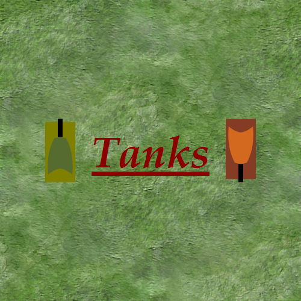

## My Library: 2htdp/image
My name: Jeremy

For this project, I intend to design and create a tank based, 2 player, top-down
fighting game. This will involve two, player controlled tanks moving around a
map and attempting to destroy one another. Each "kill" will result in a point
with the game ending after a certain number of points are gained.

In this first task, I decided to start exploring the 2htdp/image library in
in Racket so that I will be able to use it to create the various objects that
will need to be manipulated as part of the game. Starting small, I have designed
a couple of tanks, making use of the commands of the library to be able to
simply refer to them as 'Player1' and 'Player2' respectively.

I also started working with positioning, overlaying, underlaying, and
rotating of these objects so that I will be able to better grasp the nature of
how I will program the tanks and rounds to move and fire appropriately.

Much of my initial code involved working with some of the commands such as
creating simple polygons, both common, such as a circle, or square, as well as
user-defined, using points to create a unique shape.

Below I have included some images of my results, as well as the accompanying
code.



Within the above screenshot is a conglomeration of multiple images retrieved/
created in various ways, including custom polygons, prenamed polygons, an image
file loaded as a background, and an image of a string of text as rendered by the
library.

This sample is what allowed me to create this image, and as can be seen, it is
a very simple library to use:

```racket
(define sample (place-images (list (rotate 90 player1)
                                   title
                                   (rotate 270 player2))
                             (list (make-posn (- center 150) center)
                                   (make-posn center center)
                                   (make-posn (+ center 150) center))
                             createScene))
```

Other libraries that were used in this, and so were explored to some extent,
include lang/posn, as well as racket/draw, which is included by default with the
2htdp/image library.

Future work will involve creating a more dynamic start screen, improved tanks,
as well as incorporation of keyboard control, scoring, object collisions, and so
forth.