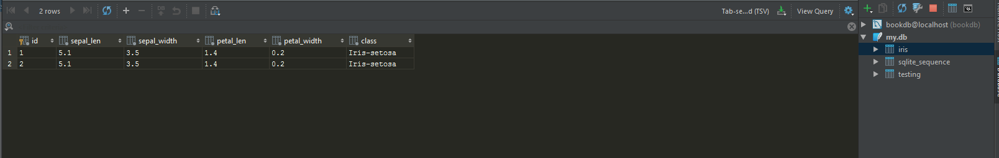

# Final Project Assignment 1: Exploration (FP1)
DUE Sunday, March 12, 2017

## My Library: sql db csv-reading
My name: Christopher Pearce

For this assignment I tested out the sql db and csv-reading libraries, to test the csv-reading library I downloaded
the iris dataset from https://archive.ics.uci.edu/ml/machine-learning-databases/iris/iris.data and used compose to
store the result in a list of lists

```
#lang racket 
;; define list of iris data directly from url
(define iris_url "https://archive.ics.uci.edu/ml/machine-learning-databases/iris/iris.data")
(define iris ((compose csv->list get-pure-port string->url) iris_url))

;; define list of iris data from .csv file
(define filename "irirs.data.csv")
(define (csvfile->list filename)
  (call-with-input-file filename
                        csv->list))
```

To test out the db library I created a sqlite database "my.db" and created some a test table and a table to store the some rows of iris data in.

```
; create test table 
(query conn
            "create table testing(id integer Primary key autoincrement, test text not null)")
 
;; create table for iris dataset 
(query-exec conn
            "create table iris
(id integer not null primary key autoincrement,
sepal_len float not null,
sepal_width float not null,
petal_len float not null,
petal_width float not null,
class text not null)")
```

The third library I tested was the sql library. it has a framework to produce sql queries using values instead of strings in the examples below
```
;; use statement above to insert a row into iris db
(query conn insert_iris
       "5.1" "3.5" "1.4" "0.2" "Iris-setosa")
       
;; see how many rows, should return a list of rows (as vectors), in this case a list of a single zero
;; vector
(query-rows
 conn
 "select count(*) from testing")

;; return all the rows in iris 
(query-rows
 conn
 "select * from iris")

;; creating an insert statement using sql lib
(insert #:into iris #:set (sepal_len "5.9") (sepal_width "3.0") (petal_len "5.1") (petal_width "1.8")
        (class "Iris-virginica"))
```
the output of running the test code is below 
```
(object:connection% ...)
(simple-result '((insert-id . #f) (affected-rows . 0)))
(simple-result '((insert-id . 1) (affected-rows . 1)))
(sql-statement
 "INSERT INTO iris (sepal_len, sepal_width, petal_len, petal_width, class) VALUES ('5.9', '3.0', '5.1', '1.8', 'Iris-virginica')")
'(#(0))
'(#(1 5.1 3.5 1.4 0.2 "Iris-setosa"))
> iris
'(("5.1" "3.5" "1.4" "0.2" "Iris-setosa")
  ("4.9" "3.0" "1.4" "0.2" "Iris-setosa")
  ("4.7" "3.2" "1.3" "0.2" "Iris-setosa")
..............
..............
..............
  ("6.5" "3.0" "5.2" "2.0" "Iris-virginica")
  ("6.2" "3.4" "5.4" "2.3" "Iris-virginica")
  ("5.9" "3.0" "5.1" "1.8" "Iris-virginica")
(""))
```



<!-- Links -->
[schedule]: https://github.com/oplS17projects/FP-Schedule
[markdown]: https://help.github.com/articles/markdown-basics/
[forking]: https://guides.github.com/activities/forking/
[ref-clone]: http://gitref.org/creating/#clone
[ref-commit]: http://gitref.org/basic/#commit
[ref-push]: http://gitref.org/remotes/#push
[pull-request]: https://help.github.com/articles/creating-a-pull-request
