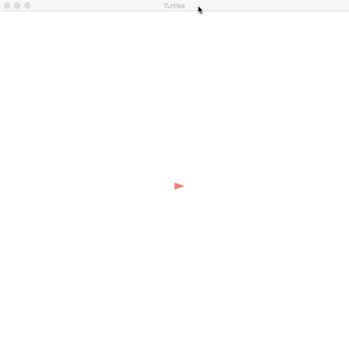
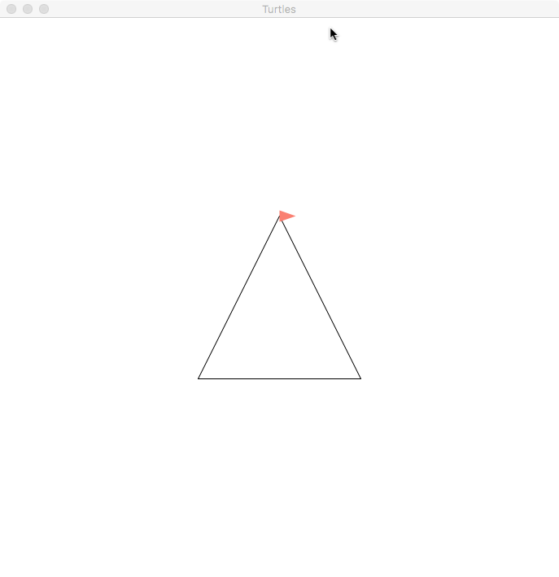
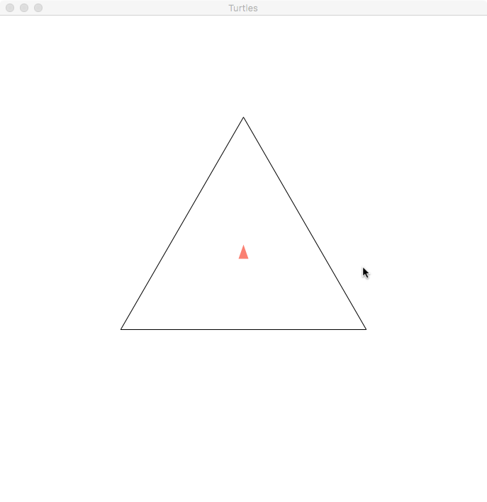
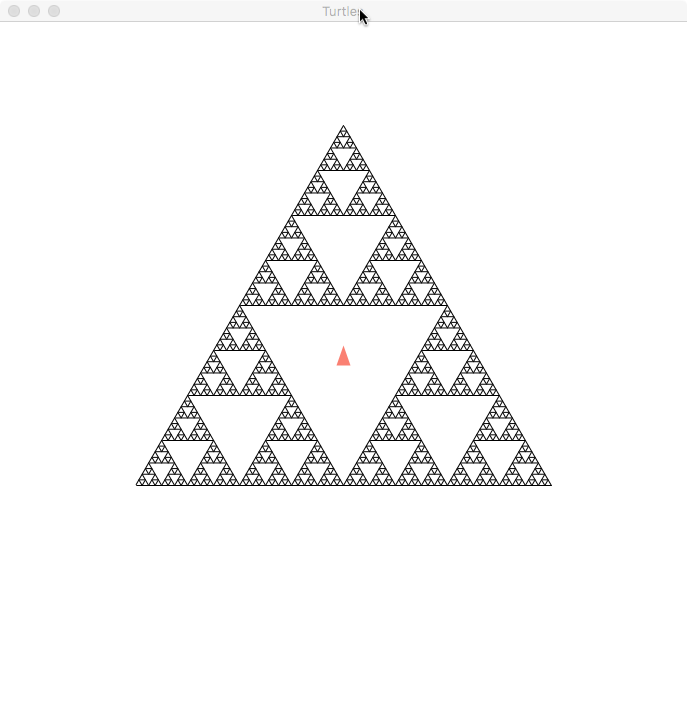

# Final Project Assignment 1: Exploration (FP1)

### Name: Leang Seu Kim
### Library: [graphics/turtles](http://docs.racket-lang.org/turtles/Traditional_Turtles.html)

This project I will be exploring turtles lib. The plan is to draw something cool with this lib. EX: sierpinski triangle
 
# Beginer level.
 
```racket
#lang racket

(require graphics/turtles)

(turtles)
```
This will create the turtle for drawing



```racket
#lang racket

(require graphics/turtles)

(turtles)

(move-offset 0 -100)
(draw-offset -100 200)
(draw-offset 200 0)
(draw-offset -100 -200)
```
`(move-offset 0 -100)` move the turtle up 100 pixel **without draw**.
`(draw-offset -100 200)` move the turtle to the left 100 pixel and down 200pixel and **draw it**.



# More advance lib
### Library [graphics/turtle-examples](http://docs.racket-lang.org/turtles/Traditional_Turtles.html#%28mod-path._graphics%2Fturtle-examples%29)

```racket
#lang racket

(require graphics/turtles graphics/turtle-examples)

(turtles)

(turn 90)
(regular-poly 3 200)
```
`(turn 90)` Turn the turtle 90 degree counter clockwise. The purple of this is to make top of triangle is pointing upward.
`(regular-poly 3 200)` Draw 3 side with 200 pixels each sides.



### Sierpinski Triangle
There are multiple way of doing this. 
1.
```racket
#lang racket

(require graphics/turtles graphics/turtle-examples)

(turtles)

(turn 90)

(sierp-nosplit sierp-size)
```



But doing this is not efficient because it will go through a lot the recursion
2.
```racket
#lang racket

(require graphics/turtles graphics/turtle-examples)

(turtles)

(turn 90)

(tprompt (sierp sierp-size))
```

This would give the same result however, it is more efficient because of the split of turtle.
`tprompt` would limit the spliting. It evaluated the expression then return turtle to original state. Without this function, there would be a lot of turtle left on the screen.


