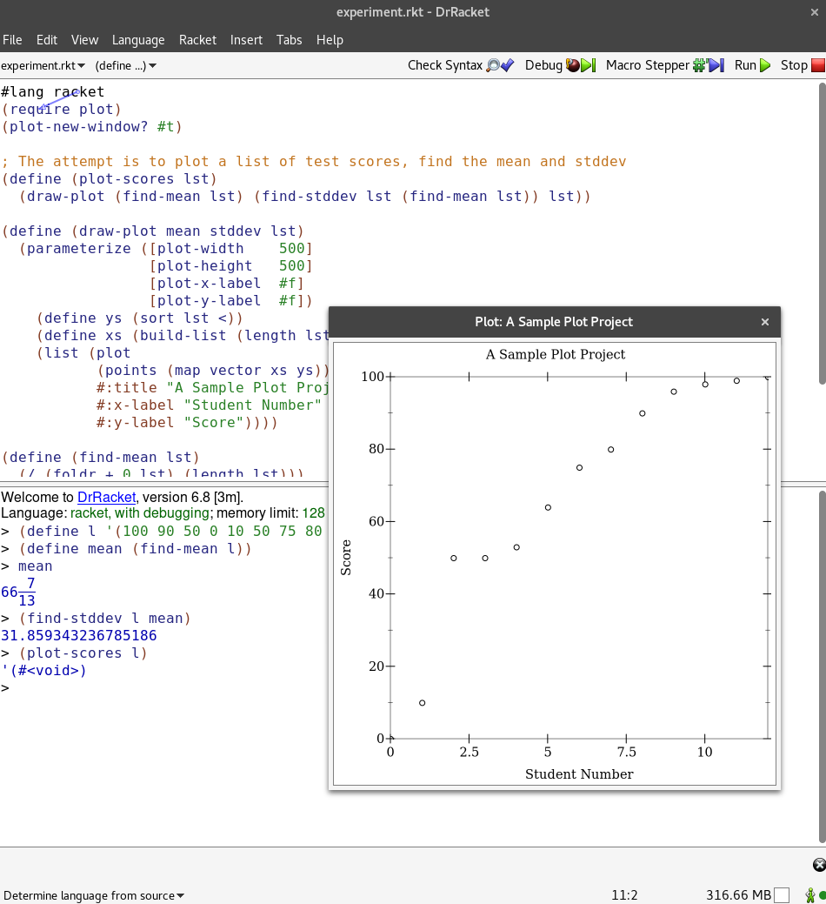

# Final Project Assignment 1: Exploration (FP1)
## My Library: web-server/servlet-env
My name: Josh Everett

Write what you did!
Remember that this report must include:

I started off on this journey believing that working with networks/sockets in racket would be similar to working
with a library like scapy in python, but it turned out not to be the case. After spending some time being confused with the TCP library provided by racket, I ended up looking into hosting a server from a local machine. The web-server/insta librar makes launching one trivial, but the servlet-env allows us to make some more customization.
```racket
;#:server-root-path  ;; misleading, requires configuration files for our server
```
I spent a lot of time trying to adjust the server root with this to point to a custom index.html page, however without the required configuration files for the racket server the site cannot host anything.

I ended up down a rabit hole in material I believed created by Lowell's very own Jay McCarthy:
[Relavent Posting][Relavent Posting]

[Racket Documentation][Racket Documentation]

[Racket Documentation I could not follow][Racket Documentation I could not follow]



<!-- Links -->
[Relavent Posting]: https://lists.racket-lang.org/users/archive/2013-September/059728.html
[Racket Documentation]: https://docs.racket-lang.org/web-server/
[Racket Documentation I could not follow]: https://docs.racket-lang.org/continue/
