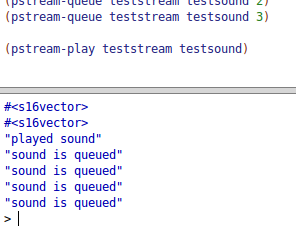

## My Library: (slideshow)
My name: Duy Truong

In this Exploration1 I try to using the sliceshow library which can help the user use Racket language create the powerpoint (slideshow).
I create a powerpoint with 3 slice.

Here is my Code

```Racket
#lang racket
(require slideshow)


(slide
 #:title (bt "Umass Lowell -- CS Department")
 #:layout 'auto
 #:gap-size (* gap-size 2)
 (t "Name: Duy Truong"))
 (t "Term : Spring 2017")
 (t "Class : Organization of Programming Languages")
 (t "Final Project Exploration 1")
 (t "Purpose: Learn new Library")


(slide
 #:gap-size (* gap-size 2)
 (para #:align 'left
       (bit "Libary Name : Sliceshow")
       )
 'next
 (para #:align 'left
       "1. Creating Slides Presentation")
 'next
 (para #:align 'left
       "2. Making Slides")
 'next
 (para #:align 'left
       "3. Typesetting Racket Code in Slideshow")
 'next)

(slide
  #:gap-size (* gap-size 2)
 (para #:align 'left
       (bit "Slide Basics")
       )
 'next
 (para #:align 'left
       "Adding library")
 'next
 (para #:align 'left
       "1. #lang slideshow")
 'next
 (para #:align 'left
       "2. #lang Racket (require slideshow)"))
```

I create 3 slide. The first slice is the introduce about myself. I Used layout to setup the layout for the Slice. I could be 'auto 'center 'top 'tall.
Gap-size is the distance between to sentence.

For the second slice and third slice, which is the detail. I using para which can understand as the paragraph. If we use para we need to have #:align which will align for the paragraph, it can be 'left, 'right.
After which para, i have next which use for show the next sentence after you click left mouse.

This is my output:

