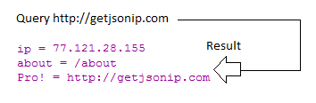

## My Library: (net-url) (json)
My name: Serey Morm

I decided to pick the net/url library not because that was going to be the easier one, but because I recently deployed my first Node.js API today on Heroku and I thought it would be cool to make some HTTP GET requests on Racket using my own API. Making the request is the easy part, I thought it would be a lot more painful in racket, but this library made it a breeze. I thought that parsing JSON would be rather cumbersome as well, but after poking around the site, there is actually a JSON library that makes the whole process a lot easier.

I didn't really try any other functions in the library, but I played around with the JSON library that checks whether an object is JSON, and many others that can turn json objects into strings for use. Which is pretty cool.

Some commands I tried:
`(input-port? myport)`
`(jsexpr? myport)`
So, I didn't want to include the entire output for my GET response because it's rather lengthy, so here is a snippet of 1 out of the 20 objects produced from the response

Base URL for API: [CLICK-HERE]

`
{
"businesses": [
{
"categories": [
{
"title": "Sushi Bars",
"alias": "sushi"
},
{
"title": "Thai",
"alias": "thai"
}
],
"phone": "+19784531112",
"id": "blue-taleh-lowell",
"distance": 1062.479508772,
"url": "https://www.yelp.com/biz/blue-taleh-lowell?adjust_creative=Qmv8zIF9edFTjGspSrTyDg&utm_campaign=yelp_api_v3&utm_medium=api_v3_business_search&utm_source=Qmv8zIF9edFTjGspSrTyDg",
"price": "$$",
"display_phone": "(978) 453-1112",
"location": {
"country": "US",
"display_address": [
"15 Kearney Sq",
"Lowell, MA 01852"
],
"state": "MA",
"address2": "",
"zip_code": "01852",
"address1": "15 Kearney Sq",
"city": "Lowell",
"address3": ""
},
"review_count": 184,
"is_closed": false,
"image_url": "https://s3-media3.fl.yelpcdn.com/bphoto/ExOcNYJLsP4BxUIDtQ-Qlw/o.jpg",
"rating": 4,
"coordinates": {
"longitude": -71.30712,
"latitude": 42.64519
},
"name": "Blue Taleh",
"transactions": []
},
`

<!-- Links -->
[CLICK-HERE]: https://github.com/oplS17projects/FP-Schedule

