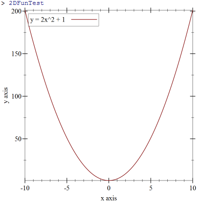

## My Library: Plot Library
My name: Thaddeus Ciras

For fp1 I just took a very basic look into the plotting library in racket.
Knowihg that this is a large library with may possible plots, I decided to
look at a simple 2D plot and a fairly simple 3D plot.

For 2D plots, I first looked at a simple sin curve.  The code looks as folows:
```racket
(require plot)
(define my2Dplot
 (plot (function sin (- pi) pi #:label "y = sin(x)")))
```
and returns the folowing output:


The function 'function' takes perameters:
* function to graph
* lower x bound
* upper x bound

After these it takes lables, allowing for the customization of each graph.
I followed this up with a quatratic graph just to get a feel for writing 
equations again after using haskell
```racket
(define 2DFunTest
  (plot (function (λ (x) (+ (* x x 2) 1)) (- 10) 10 #:label "y = 2x^2 + 1")))
```
and got the following graph:


Finally, I did the 3D plot of a sphere just to see how much of the sphere
would appear, as most graphing programs cut it off before it can close:
```racket
(define my3DPlot
  (plot3d (surface3d (λ (x y) (+ (* x x) (* y y))) (- pi) pi (- pi) pi)
                     #:title "Sphere"
                     #:x-label "x"
                     #:y-label "y"
                     #:z-label "x^2 + y^2"))
```
giving the result:


which cuts the sphere off at z = 20

The parameters for plot3D are:
* equation
* min x value
* max x value
* min y value
* max y value
and then the labels ine hte same regard as the 2D plot.
